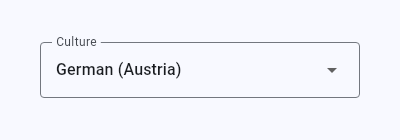

# mat_culture_selector

## Purpose

`mat_culture_selector` is a flutter-widget which lets the user choose a culture (for example `en-GB`, `de`, `de-AT` or `fr`) from a configurable list of cultures.

## Idea

Applications which are available in several languages or regional variants usually need one control which lets the user switch between them. Which cultures are offered - and which text is shown for each of them - differs per application, so the widget does not hard-code either: it takes the list as a parameter and only reports which culture the user chose. Applying the chosen culture (for example switching the locale of the application) is deliberately left to the application which uses the widget.

## Example




The closed control always shows the label of the currently chosen culture. Tapping it opens a dropdown which lists the label of every culture that was passed in - this is the native behavior of the underlying material-widgets and needs no further code.

## Requirements

- Flutter 3.24 or newer
- Material design (the widget is built on `DropdownButton` and `InputDecorator`)

## Installation

The package is published at [pub.dev/packages/mat_culture_selector](https://pub.dev/packages/mat_culture_selector).

```
flutter pub add mat_culture_selector
```

## Usage

### 1. Enable material design once

The widget is built on material design, so the application has to be a material-application. That is the case as soon as its widget-tree is below a `MaterialApp`:

```dart
MaterialApp(
  theme: ThemeData(colorSchemeSeed: Colors.blue),
  home: const MyPage(),
)
```

### 2. Use the widget

The closed control always shows the label of the currently chosen culture; tapping it opens a dropdown with the label of every culture that was passed in. Like every other material form-field the widget takes the width it is given, so it is placed somewhere with a bounded width (here a `SizedBox`):

```dart
import 'package:flutter/material.dart';
import 'package:mat_culture_selector/mat_culture_selector.dart';

class Toolbar extends StatefulWidget {
  const Toolbar({super.key});

  @override
  State<Toolbar> createState() => _ToolbarState();
}

class _ToolbarState extends State<Toolbar> {
  static const List<MatCultureOption> _cultures = <MatCultureOption>[
    MatCultureOption(culture: 'en-GB', label: 'English (UK)'),
    MatCultureOption(culture: 'de', label: 'German'),
    MatCultureOption(culture: 'de-AT', label: 'German (Austria)'),
    MatCultureOption(culture: 'fr', label: 'French'),
  ];

  String? _chosenCulture;

  @override
  Widget build(BuildContext context) {
    return SizedBox(
      width: 320,
      child: MatCultureSelector(
        cultures: _cultures,
        selectedCulture: _chosenCulture,
        onCultureSelected: _onCultureSelected,
      ),
    );
  }

  void _onCultureSelected(String culture) {
    setState(() {
      _chosenCulture = culture;
    });
    // for example: switch the locale of the application
  }
}
```

### 3. Parameters

| Name | Type | Default | Description |
| --- | --- | --- | --- |
| `cultures` | `List<MatCultureOption>` | (required) | The cultures the user can choose from. Each entry has a `culture` (the identifier, for example `'en-GB'`) and a `label` (the text shown for it, typically the language-name in English, for example `'English (UK)'`). The entries are shown in the given order and their `culture`-values have to be distinct. |
| `onCultureSelected` | `ValueChanged<String>` | (required) | Called with the `culture` of the entry the user chose. |
| `selectedCulture` | `String?` | `null` | The `culture` of the entry which is preselected. A value which is not part of `cultures` is treated as "nothing is chosen". |
| `label` | `String` | `'Culture'` | The label of the control itself. Set it to a translated text if the application is localized. |

Both which cultures are offered and which text is shown for each of them are decided entirely by the caller - the widget does not hard-code or know about any real-world culture. It also does not apply the chosen culture anywhere itself (neither to the locale of the application, nor to a translation-package, nor to a persisted setting): which mechanism an application uses to switch its locale is its own decision.

## Example-application

The package contains a small application which shows the widget (`mat_culture_selector/example`). It is started with `flutter run` in that folder, or with `task rd` from the root of the repository.

## License

See the [license](../License.txt) of the repository.
