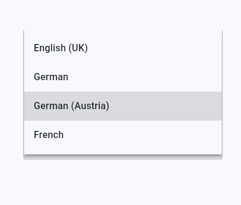

# MatCultureSelector

## Purpose

MatCultureSelector is the repository of `mat_culture_selector`, a flutter-widget which lets the user choose a culture (for example `en-GB`, `de`, `de-AT` or `fr`) from a configurable list of cultures.

It is the flutter-counterpart of [ngx-culture-selector](https://github.com/anionDev/NgxCultureSelector), which offers the same thing for angular-applications.

## Example




Which cultures are offered - and which text is shown for each of them - is decided entirely by the application which uses the widget: the widget takes the list as a parameter and only reports which culture the user chose. Applying that choice (for example switching the locale of the application) is deliberately left to that application.

Development-state: active development.

## Code-units

| Code-unit | Content | State |
|---|---|---|
| `MatCultureSelector` | The widget itself, published on pub.dev as the package `mat_culture_selector`, including its example-application. | enabled |

## Installation and usage

The package is published at [pub.dev/packages/mat_culture_selector](https://pub.dev/packages/mat_culture_selector) and is installed with `flutter pub add mat_culture_selector`.

How the widget is used and which parameters it has is documented in the [readme of the code-unit](MatCultureSelector/ReadMe.md), which is also what pub.dev shows on the page of the package. It is documented there and not here so that both descriptions can not drift apart.

## Development

This repository implements the common project structure. The whole pipeline (build, linting, testcases) runs with:

```
task bb
```

The example-application which shows the widget is started with `task rd`.

Besides the widget-tests the repository has visual-regression-tests which render the widget and compare the result with the baseline-images in `MatCultureSelector/Other/Resources/VisualRegressionBaselines`. They run inside a container so that the result is reproducible independently of the operating-system, which is also why a plain `flutter test` skips them. The two example-pictures above are exactly those baseline-images, so they can not drift apart from what the tests assert. After an intended change of the appearance the baseline-images are regenerated with `task uvrb`.

## Contributing

See [Contributing.md](Contributing.md).

## License

See [License.txt](License.txt).
