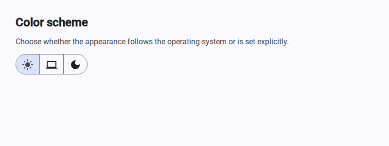

# NgxDarkmodeToggleButton

## Purpose

`ngx-darkmode-toggle-button` is an angular-component which lets the user choose the color-scheme of a web-application between the three modes `system`, `light` and `dark`. The choice is kept over reloads and sessions.

## Idea

Apps, web-sites and web-applications usually have a light- and a dark-appearance, and the operating-systems have that setting as well. Most users want the application to simply follow their operating-system, but they also want to be able to overrule that for one application.

A two-state toggle can not express that: it only knows "light" and "dark" and therefore loses exactly the mode which most users want. This component therefore offers all three modes at the same time, each of them reachable with one click.

## Example



The three modes are visible at the same time and the active one is highlighted. In the mode `dark` the same page is dark and the third button is the highlighted one.

## Requirements

- Angular 22
- Angular Material 22 (the component uses the Material-3-theming-API and the system-tokens `--mat-sys-*`)
- An icon-font which is provided by the application, see step 3 of the usage. This package deliberately does not bring one: which icon-font an application uses is its own decision, and a second one would only add weight.

## Installation

The package is published at [npmjs.com/package/@aniondev/ngx-darkmode-toggle-button](https://www.npmjs.com/package/@aniondev/ngx-darkmode-toggle-button).

```
npm install @aniondev/ngx-darkmode-toggle-button
```

## Usage

### 1. Include the theme once

The component does not bring its own theme and does not exchange stylesheets at runtime. It only switches the css-property `color-scheme`, which Material-3 evaluates by itself. Include `mat.theme()` exactly once in your `styles.scss`:

```scss
@use '@angular/material' as mat;

html {
  color-scheme: light dark;              // this is the mode "system"
  @include mat.theme((color: mat.$azure-palette, typography: Roboto, density: 0));

  &[data-theme='light'] { color-scheme: light; }
  &[data-theme='dark']  { color-scheme: dark; }
}

body {
  background: var(--mat-sys-background);
  color: var(--mat-sys-on-background);
}
```

Own components must take their colors from the system-tokens (`var(--mat-sys-on-surface)` and so on). A hard-coded color stays as it is when the scheme changes.

### 2. Set the attribute before the first frame

Without this the page is drawn in the wrong scheme for a moment after a reload. Put this blocking script into the `<head>` of your `index.html`, before all stylesheets:

```html
<script>
  var t = localStorage.getItem('theme');
  if (t && t !== 'system') document.documentElement.setAttribute('data-theme', t);
</script>
```

The duplication of that logic is intended: the attribute has to be set before the application is bootstrapped.

### 3. Provide an icon-font

The component shows its three modes as icons of the font `Material Icons` (`light_mode`, `computer` and `dark_mode`). The font is provided by the application, not by this package.

If the font is loaded from a font-provider then its stylesheet usually already assigns the font to the elements. If it is delivered with the application (which makes the appearance independent of an external service) then the assignment has to be made once, because the font-package only contains the font itself:

```scss
mat-icon {
  font-family: 'Material Icons';
  font-size: 24px;
  line-height: 1;
  font-feature-settings: 'liga';
}
```

Without this an icon is displayed as the text of its name instead of as a symbol.

### 4. Use the component

The component is standalone, so it is imported directly by the component which shows it:

```typescript
import { Component } from '@angular/core';
import { NgxDarkmodeToggleButtonComponent } from '@aniondev/ngx-darkmode-toggle-button';

@Component({
  selector: 'app-toolbar',
  imports: [NgxDarkmodeToggleButtonComponent],
  template: `<ngx-darkmode-toggle-button />`,
})
export class ToolbarComponent { }
```

The labels can be replaced, for example by translated texts:

```html
<ngx-darkmode-toggle-button
  aria-label="Farbschema"
  lightLabel="Hell"
  systemLabel="System"
  darkLabel="Dunkel" />
```

### 5. Read or set the mode from code

The chosen mode is available as a signal, so it can be read and written from anywhere - for example to store it in the profile of the user:

```typescript
import { Component, effect, inject } from '@angular/core';
import { NgxDarkmodeService, ThemeMode } from '@aniondev/ngx-darkmode-toggle-button';

@Component({ /* ... */ })
export class SettingsComponent {

  private readonly darkmodeService = inject(NgxDarkmodeService);

  public constructor() {
    effect(() => {
      const mode: ThemeMode = this.darkmodeService.mode();
      // for example: send the mode to the backend of your application
    });
  }

  public applyModeOfUserProfile(mode: ThemeMode): void {
    this.darkmodeService.mode.set(mode);
  }
}
```

## Behavior

| Mode | Attribute `data-theme` | `color-scheme` | Result |
| --- | --- | --- | --- |
| `system` | not set | `light dark` | follows the operating-system-theme |
| `light` | `light` | `light` | always light, the operating-system is ignored |
| `dark` | `dark` | `dark` | always dark, the operating-system is ignored |

The mode is stored in the `localStorage` under the key `theme`. A missing or an invalid value is treated as `system`, which is also the default for a user who did not choose anything yet.

With server-side-rendering or prerendering neither `localStorage` nor `window` is touched while the service is constructed: the stored value is read in `afterNextRender`.

## Development

This repository implements the common project structure. The whole pipeline (build, linting, testcases) runs with:

```
task bb
```

The repository contains a small demo-application which shows the component (it is not part of the published package). It is started with `task rd` and it is also what the visual-regression-tests take their screenshots of. After an intended change of the appearance the baseline-screenshots are regenerated with `task uvrb`.

> **Note:** The script `NgxDarkmodeToggleButton/Other/QualityCheck/UpdateVisualRegressionBaselines.py` is permitted to modify files in the `<repo>/Other` directory, specifically to update the readme example image at `Other/Reference/Technical/Images/ThemeSwitcher.png` to always show the current appearance of the component.

## License

See `License.txt`.
